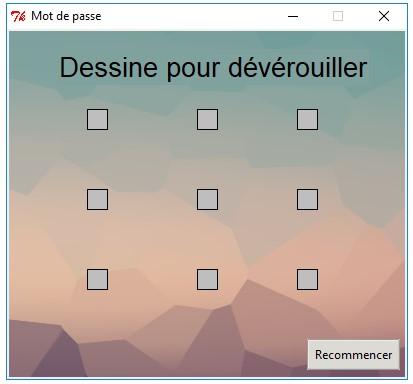
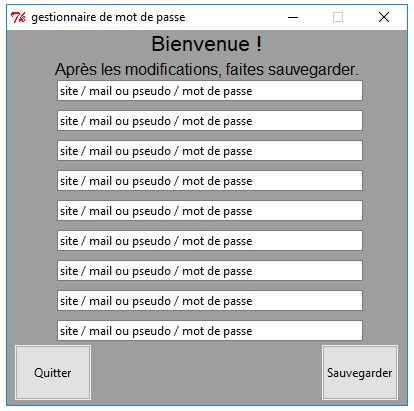

<!DOCTYPE html>
<html>

<head>
  <meta charset="utf-8">
  <meta name="viewport" content="width=device-width, initial-scale=1.0">
  <link rel="stylesheet" href="https://stackedit.io/style.css" />
</head>

<body class="stackedit">
  
<h1 id="password-manager">Password-Manager</h1>
<h1 id="fonctionnalités">Fonctionnalités</h1>
<ul>
<li>Logiciel utilisable sans connexion afin d’y conserver ses mots de passe en sécurité</li>
<li>Utilisation d’une combinaison afin d’avoir accès à ses mots de passe</li>
</ul>
<h1 id="installation">Installation</h1>
<ul>
<li>Modifier la combinaison de touche pour déverrouiller le logiciel</li>
<li>Modifier la clé du Chiffre de Vigenère</li>
<li>Compiler le script avec <code>cx_Freeze</code>  par exemple, pour que le code soit sécurisé</li>
</ul>
<h1 id="présentation">Présentation</h1>

</body>

</html>
